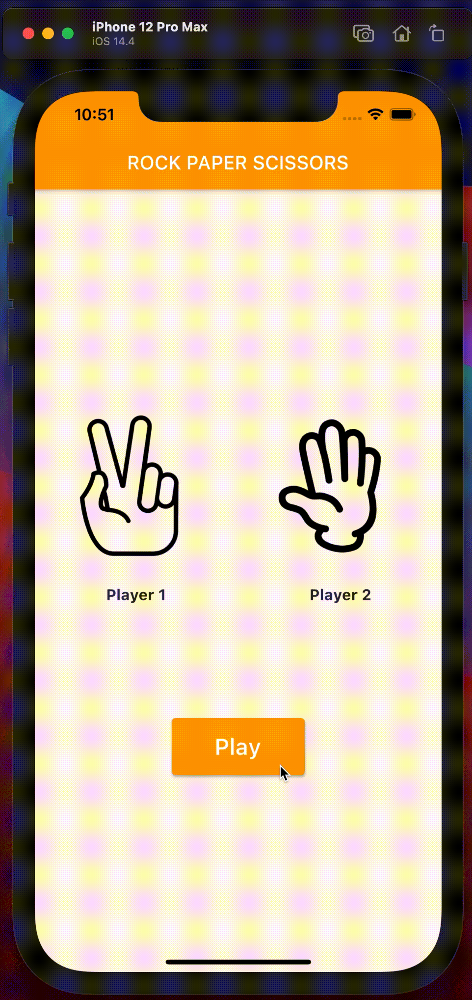
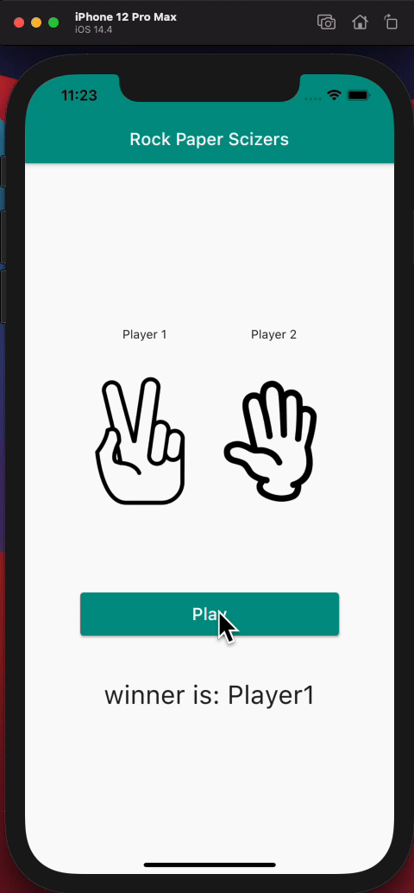

# UC-Flutter-cw-5

## تمرين 1

لعبة حجر ورق مقص, (Rock Paper Scissors)

1. قم بعمل fork للـ repository
2. افتح الـ repository باستخدام github desktop
3. ادخل على برنامج VS code وانشاء ملف تمرين داخل مجلد cw-1 في ال repository
4. قم بإنشاء برنامج Flutter جديد و احفظه داخل الملف
5.  أضف MateiralApp و Scoffold للبرنامج
6.  قم بإضافة الصور الثلاثة داخل مجلد assets
7. وقم بإضافة صورتين و نصيين مع زر play
8. قم بإنشاء متغيريين يحملون أرقام عشوائية بين 1 و 3
9. استخدم المتغيريين لتغير الصور

hints:

- stateful widget
- Button widget
- Text widget
- Image widget
- استعمل الدالة لتوليد رقم عشوائي بين ١ و ٣
  > Random().nextInt(3) + 1;

---

## بونص

قم بإضافة نص يقوم بتحديد الفائز بين اللاعبين

hint:

- استعمل Text widget
- استخدم الجمل الشرطية if else لتحديد الفائز
